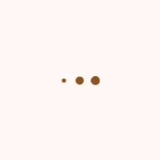
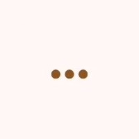
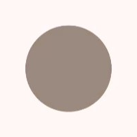
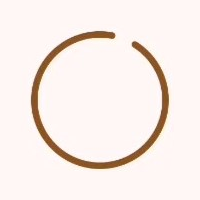
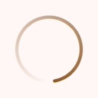
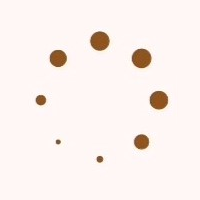
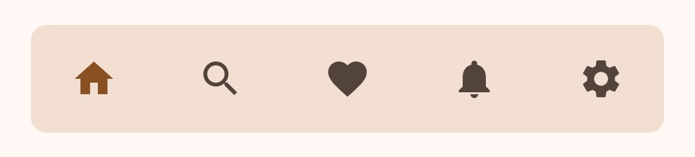
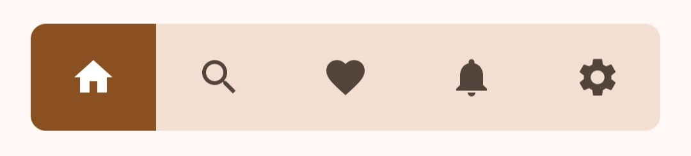
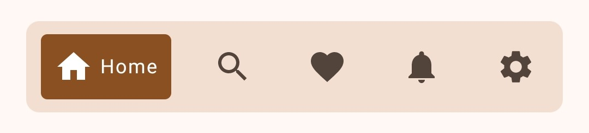
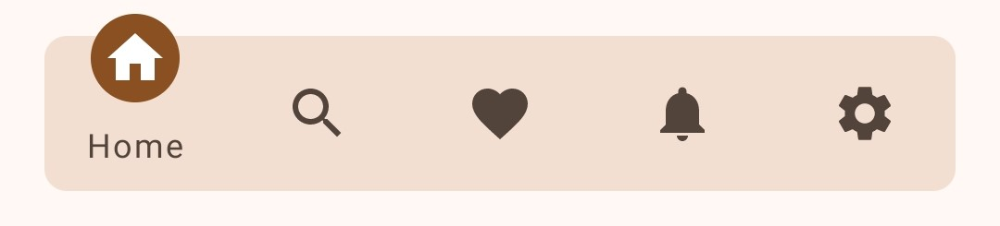

# Jetpack Compose Components 🎨

A curated collection of reusable and customizable Jetpack Compose components to accelerate your Android UI development.

## ✨ Features

* **Beautiful and Versatile:**  Provides a range of pre-styled composables to enhance your app's visual appeal.
* **Easy Integration:**  Seamlessly integrate these components into your existing Jetpack Compose projects.
* **Theming Support:**  Customize the appearance of components to match your app's design system.
* **Open for Contributions:**  We welcome contributions from the community to expand and improve this toolkit!

## 🚀 Getting Started

1. **Add the JitPack repository to your root build.gradle file:**
    ```gradle
    // Groovy DSL
    dependencyResolutionManagement {
        ...
        repositories {
            ...
            maven { url 'https://jitpack.io' }
        }
    }
    ```
    ```gradle
    // Kotlin DSL
    dependencyResolutionManagement {
        ...
        repositories {
            ...
            maven { setUrl("https://jitpack.io") }
        }
    }
    ```
   
2. **Add the dependency:**
    ```gradle
    // Groovy DSL
    dependencies {
        implementation 'com.github.Tanish-Ranjan:jetpack_compose_components:<version>'
    }
    ```
    ```gradle
    // Kotlin DSL
    dependencies {
        implementation("com.github.Tanish-Ranjan:jetpack_compose_components:<version>")
    }
    ```

3. **Use the Composable:**
    ```kotlin
    @Composable
    fun MyScreen() {
        // Example usage of a circular throbber
        CircularThrobber1(
            modifier = Modifier.size(100.dp),
            color = Color.Blue
        )
        
    }
    ```

## 📚 Components

### 1. Linear Throbbers

Simple and smooth progress indicators for linear actions.

| Preview | Component |
|---|---|
|  | LinearThrobber1 |
|  | LinearThrobber2 |

### 2. Circular Throbbers

Circular progress indicators for various use cases.

| Preview | Component |
|---|---|
|  | CircularThrobber1 |
|  | CircularThrobber2 |
|  | CircularThrobber3 |
|  | CircularThrobber4 |

### 3. Bottom Navigation Bars

Easy-to-use navigation bars for the bottom of your screen.

| Preview | Component |
|---|---|
|  | BottomNavigationBar1 |
|  | BottomNavigationBar2 |
|  | BottomNavigationBar3 |
|  | BottomNavigationBar4 |
|  | BottomNavigationBar5 |

## 🤝 Contributing

We welcome contributions! Please check out our [CONTRIBUTING.md](CONTRIBUTING.md) guide for details on how to get involved.

## 📄 License

This project is licensed under the [MIT License](LICENSE).