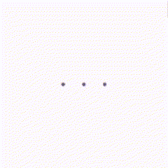
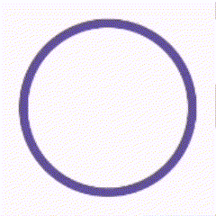
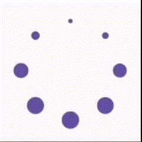

# Components

Following are all the components provided by this library.

## Linear Throbbers

Simple and smooth linear progress indicators for various
actions. [Read More](./components/linear_throbber/README.md)

| Preview                                                                                           | Variant                                                             | Added In |
|---------------------------------------------------------------------------------------------------|---------------------------------------------------------------------|---------:|
|  | [BloomingDots](./components/linear_throbber/README.md#BloomingDots) |   v1.0.0 |
|  | [BouncingDots](./components/linear_throbber/README.md#BouncingDots) |   v1.0.0 |

## Circular Throbbers

Circular progress indicators for various use
cases. [Read More](./components/circular_throbber/README.md)

| Preview                                                                                   | Variant                                                     | Added In |
|-------------------------------------------------------------------------------------------|-------------------------------------------------------------|---------:|
|    | [Ripple](./components/circular_throbber/README.md#Ripple)   |   v1.0.0 |
|          | [Web](./components/circular_throbber/README.md#Web)         |   v1.0.0 |
|  | [Windows](./components/circular_throbber/README.md#Windows) |   v1.0.0 |
|    | [Legacy](./components/circular_throbber/README.md#Legacy)   |   v1.0.0 |

## Bottom Navigation Bars

Easy-to-use navigation bars for the bottom of your
screen. [Read More](./components/bottom_navigation_bar/README.md)

| Preview                                                                                                | Variant                                                                   | Added In |
|--------------------------------------------------------------------------------------------------------|---------------------------------------------------------------------------|---------:|
|            | [Minimal](./components/bottom_navigation_bar/README.md#Minimal)           |   v1.0.0 |
|              | [Filled](./components/bottom_navigation_bar/README.md#Filled)             |   v1.0.0 |
|          | [Standard](./components/bottom_navigation_bar/README.md#Standard)         |   v1.0.0 |
|  | [StandardText](./components/bottom_navigation_bar/README.md#StandardText) |   v1.0.0 |
|                  | [Sway](./components/bottom_navigation_bar/README.md#Sway)                 |   v1.0.0 |