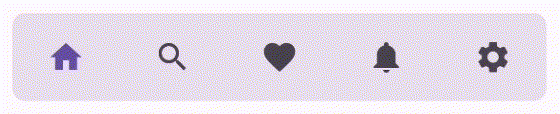
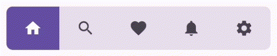
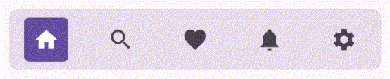
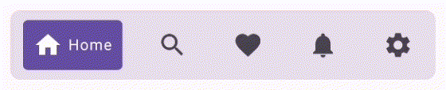
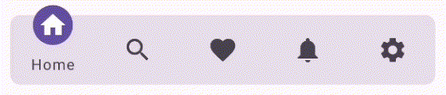

# Bottom Navigation Bar

Following are the different variants of Bottom Navigation Bar available in this library:

## Minimal

A Bottom Navigation Bar where each tab is represented by their icons which shrink when pressed.

### Properties

- `navItems` - used to populate the tabs.
- `iconSize` - sets the size for each icon.
  default: 24.dp.
- `shrinkSize` - sets the factor by which the `iconSize` is reduced during pressed state.
  default: 4.dp
- `defaultSelectedIndex` - sets the index of the item to be selected by default.
  default: 0
- `shape` - sets the shape of the Bottom Navigation Bar.
  default: RoundedCornerShape(8.dp)
- `navigationBarColor` - sets the color of the Bottom Navigation Bar.
  default: surfaceVariant color from Material Theme.
- `itemTint` - sets the tint color of icon for all non-selected items.
  default: onSurfaceVariant color from Material Theme.
- `selectedItemTint` - sets the tint color of icon for the selected item.
  default: primary color from Material Theme.

sample

## Filled

A Bottom Navigation Bar where each tab is represented by their icons and the selected item is
indicated by a rectangular indicator behind the icon.

### Properties

- `navItems` - used to populate the tabs.
- `iconSize` - sets the size for each icon.
  default: 24.dp.
- `defaultSelectedIndex` - sets the index of the item to be selected by default.
  default: 0
- `shape` - sets the shape of the Bottom Navigation Bar.
  default: RoundedCornerShape(8.dp)
- `navigationBarColor` - sets the color of the Bottom Navigation Bar.
  default: surfaceVariant color from Material Theme.
- `itemTint` - sets the tint color of icon for all non-selected items.
  default: onSurfaceVariant color from Material Theme.
- `selectedItemTint` - sets the tint color of icon for the selected item.
  default: primary color from Material Theme.
- `selectedBackgroundTint` - sets the tint color of indicator for the selected item.
  default: primary color from Material Theme.

sample

## Standard

A Bottom Navigation Bar where each tab is represented by their icons and the selected item is
indicated by a rounded rectangular indicator behind the icon.

### Properties

- `navItems` - used to populate the tabs.
- `iconSize` - sets the size for each icon.
  default: 24.dp.
- `defaultSelectedIndex` - sets the index of the item to be selected by default.
  default: 0
- `shape` - sets the shape of the Bottom Navigation Bar.
  default: RoundedCornerShape(8.dp)
- `navigationBarColor` - sets the color of the Bottom Navigation Bar.
  default: surfaceVariant color from Material Theme.
- `itemTint` - sets the tint color of icon for all non-selected items.
  default: onSurfaceVariant color from Material Theme.
- `selectedItemTint` - sets the tint color of icon for the selected item.
  default: primary color from Material Theme.
- `selectedBackgroundTint` - sets the tint color of indicator for the selected item.
  default: primary color from Material Theme.
- `selectedItemCornerRadius` - sets the corner radius of the indicator.
  default: 4.dp.
- `internalPadding` - sets the padding of the indicator with respect to the icon.
  default: 8.dp.

sample

## StandardText

A Bottom Navigation Bar where each tab is represented by their icons and the selected item is
indicated by a rounded rectangular indicator behind the icon with the tab title.

### Properties

- `navItems` - used to populate the tabs.
- `iconSize` - sets the size for each icon.
  default: 24.dp.
- `fontSize` - sets the text size for each title.
  default: 12.sp.
- `defaultSelectedIndex` - sets the index of the item to be selected by default.
  default: 0
- `shape` - sets the shape of the Bottom Navigation Bar.
  default: RoundedCornerShape(8.dp)
- `navigationBarColor` - sets the color of the Bottom Navigation Bar.
  default: surfaceVariant color from Material Theme.
- `itemTint` - sets the tint color of icon for all non-selected items.
  default: onSurfaceVariant color from Material Theme.
- `selectedItemTint` - sets the tint color of icon for the selected item.
  default: primary color from Material Theme.
- `selectedBackgroundTint` - sets the tint color of indicator for the selected item.
  default: primary color from Material Theme.
- `selectedItemCornerRadius` - sets the corner radius of the indicator.
  default: 4.dp.
- `internalPadding` - sets the padding of the indicator with respect to the icon.
  default: 8.dp.

sample

## Sway

A Bottom Navigation Bar where each tab is represented by their icons and the selected item is
indicated by a circular indicator behind the icon which is offset vertically revealing the title
below.

### Properties

- `navItems` - used to populate the tabs.
- `iconSize` - sets the size for each icon.
  default: 24.dp.
- `fontSize` - sets the text size for each title.
  default: 12.sp.
- `defaultSelectedIndex` - sets the index of the item to be selected by default.
  default: 0
- `shape` - sets the shape of the Bottom Navigation Bar.
  default: RoundedCornerShape(8.dp)
- `navigationBarColor` - sets the color of the Bottom Navigation Bar.
  default: surfaceVariant color from Material Theme.
- `itemTint` - sets the tint color of icon for all non-selected items.
  default: onSurfaceVariant color from Material Theme.
- `selectedItemTint` - sets the tint color of icon for the selected item.
  default: primary color from Material Theme.
- `selectedBackgroundTint` - sets the tint color of indicator for the selected item.
  default: primary color from Material Theme.
- `selectedItemOffset` - sets the offset by which the selected item is raised.
  default: 8.dp.
- `internalPadding` - sets the padding of the indicator with respect to the icon.
  default: 8.dp.

sample

