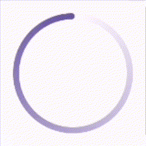
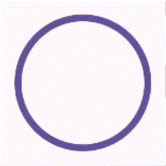
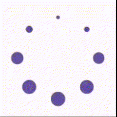

# Circular Throbber

Following are the different variants of Circular Throbber available in this library:

## Ripple

A circle whose radius and alpha value is animated to give a ripple effect.

### Properties

- `color` - sets the color of the ripple.
  default: primary color from Material Theme.

sample

## Web

An animated gradient circular ring which gives the appearance of circular throbbers on most web
applications.

### Properties

- `color` - sets the color of the gradient circular ring.
  default: primary color from Material Theme.
- `strokeWidth` - sets the width of the circular gradient ring.
  default: 4.dp
- `deflectionAngle` - sets the angle by which the start position of the throbber's animation needs
  to be deflected.
  default: 0f

sample

## Windows

An animated circular ring whose circumference is animated to give the appearance of circular
throbbers from windows devices.

### Properties

- `color` - sets the color of the circular ring.
  default: primary color from Material Theme.
- `trackColor` - sets the color of the circular ring's track.
  default: transparent.
- `strokeWidth` - sets the width of the circular ring.
  default: 4.dp
- `deflectionAngle` - sets the angle by which the start position of the throbber's animation needs
  to be deflected.
  default: 0f

sample

## Legacy

Eight dots arranged in circle which expand and shrink in a succession giving the effect of it
rotating clockwise.

### Properties

- `color` - sets the color of each dot.
  default: primary color from Material Theme.
- `dotRadius` - sets the radius of each dot.
  default: 4.dp

sample

